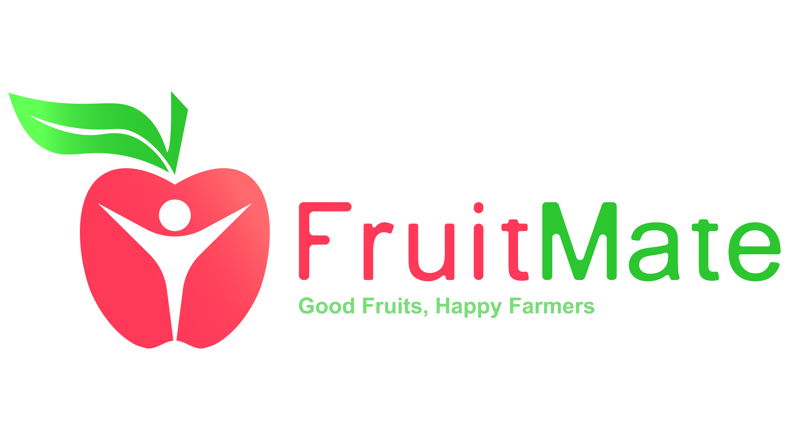

# Cloud Computing - FruitMate

<h1 align="center">
  </img>

## About This App
The FruitMate application is an application that can help detect the level of fruit ripeness. It is equipped with additional features such as news, fruit information, fruit storage information, and plant care. This application is expected to assist users, especially farmers, in predicting which fruits are suitable to enter the market.

## Project Plan
The project plan file can be accessed at the following link: https://drive.google.com/file/d/1iUHJNwcBXzqq-hiii_t34qfCoUvwZK7y/view?usp=sharing

## List of Contents

1. [FruitMate Team Member](#team-member)
2. [API Description](#api-description)
3. [Stacks](#stacks)
4. [How to Deploy API?](#how-to-deploy)
5. [API Endpoints](#api-enspoints)

## Team Member

The following are the team members involved in the development of this project:

| Name                                    | Student-ID  | Learning Path      | Role                                        | Contacts                                                                                                                  |
| :-------------------------------------- | :---------- | :----------------- | :------------------------------------------ | :------------------------------------------------------------------------------------------------------------------------ |
| Riesco Alief Frendnanda Editya          | M207DSX2302 | Machine Learning   | Project Manager & Machine Learning Engineer | [LinkedIn](https://www.linkedin.com/in/riesco-alief-frendnanda-editya-a65929244/) & [Github](https://github.com/riszt892) |
| Noraini Latifah                         | M207DSY3260 | Machine Learning   | Machine Learning Engineer                   | [LinkedIn](https://www.linkedin.com/in/norainilatifah/) & [Github](https://github.com/Noraini09)                          |
| I Wayan Guna Permana                    | C368DSX2417 | Cloud Computing    | DevOps Engineer                             | [LinkedIn](https://www.linkedin.com/in/i-wayan-guna-permana/) & [Github](https://github.com/gunapermana)                  |
| Anak Agung Made Semara Putra            | C368DSX2788 | Cloud Computing    | DevOps Engineer                             | [LinkedIn](https://www.linkedin.com/in/gungwahada1/) & [Github](https://github.com/Gungwahada1)                           |
| I Gusti Agung Ngurah Fajar Dharmawangsa | A013DSX1415 | Mobile Development | Android Developer                           | [LinkedIn](https://www.linkedin.com/in/ngurahfajar/) & [Github](https://github.com/NgurahFajar)                           |
| Muhammad Rafif Baihaqi                  | A013DSX1421 | Mobile Development | Android Developer                           | [LinkedIn](https://www.linkedin.com/in/muhammad-rafif-baihaqi-198b56226/) & [Github](https://github.com/Raff-28)          |

## API Description

RESTful APIs deployed on Google Cloud Platform using the services of App Engine, Google Cloud Storage, Firebase Authentication, and Firestore in Firebase. This API functions to take requests and then process data on the server side and return responses back to the user.

## Stacks

- Python
- Flask Framework
- App Engine (Google Cloud Platform)
- Google Cloud Storage (Google Cloud Platform)
- Firebase Authentication (Google Cloud Platform)
- Firebase Firestore (Google Cloud Platform)
- Postman

## How to Deploy

- ### Cloud Architecture


- ### Clone Repository
  You can clone the repository, you can do this by downloading this repo or using the terminal by:
  ```shell
  git clone https://github.com/FruitMate/Cloud-Computing.git
  ```
  ```shell
  cd Cloud-Computing
  ```
- ### Install All Packages
  To run the API requiring some Python libraries and packages using pip, you can download all the required libraries by running:
  ```shell
  pip install -r requirements.txt
  ```
- ### Provisioning App Engine, Google Cloud Storage Bucket, Create Firebase Authentication, and Firebase Firestore
  Make your project on the Google Cloud Platform, provisioning App Engine for computing, Google Cloud Storage Bucket to store scanned images and history, Firebase Authentication to authenticate users via Firebase, and create Firebase Firestore to store user scan data in the history feature
- ### Config Service Account
  You need a service account to be able to access Google Cloud Platform services, please put the firebase serviceAccount.json file in **/config/firebase/** and Google Cloud Storage serviceAccount.json in **/config/google-cloud-storage/**
- ### Deploy API
  Go to Cloud Editor or Cloud Shell, run this command:
  ```shell
  gcloud app deploy
  ```
- ### Get HTTP URL
  For testing, we should have http url, run this command:
  ```shell
  gcloud app browse
  ```
- ### Testing with Postman
  You can use Postman to test the server according to the endpoints below, here are the steps:
  - Install Postman
  - Take the url after deploy at url field at Postman
  - Choose the Method
  - Adjust the endpoint
  - Setting header & request body
  - Get the result with click `SEND`

## API Endpoints

### URL:

### 1. Endpoint: `/`

#### Running Test

- _Method_: GET
- _Header_: -
- _Request Body_: -
- _Response_:
  ```json
  {
    "message": "Application running!"
  }
  ```

### 2. Endpoint: `/api/scan-apple`

#### Endpoint to receive requests and provide responses to fruit classification

- _Method_: POST
- _Header_:
  - **`Content-Type: multipart/form-data`**
- _Request Body_:
  - **`-`**
- _Response_:
  ```json
  {
    "code": 200,
    "message": "Classification Success!",
    "prediction": "overripe"
  }
  ```

### 3. Endpoint: `/api/history/[param]`

#### Endpoint to receive requests and provide responses to fruit classification

- _Method_: GET
- _Header_:
  - **`-`**
- _Request Body_:
  - **`-`**
- _Request Params_:
  | Parameter | Type | Description |
  | :-------- | :------ | :------------------------ |
  | Email | String | Authenticated user email |

- _Response_:
  ```json
  {
    "code": 200,
    "data": [
      {
        "uid": "iYqXpePAHAd97Rwum1lNMPpTk234",
        "classification_result": "overripe",
        "timestamp": "2023-06-07 15:43:59",
        "image_url": "https://storage.googleapis.com/img-history-storage-bucket/20230607154356_iYqXpePAHAd97Rwum1lNMPpTk2N2_0TjqBkd6WD.jpg"
      },
      {
        "uid": "iYqXpePAHAd97Rwum1lNMPpTk234",
        "classification_result": "unripe",
        "timestamp": "2023-06-07 15:56:07",
        "image_url": "https://storage.googleapis.com/img-history-storage-bucket/20230607155606_iYqXpePAHAd97Rwum1lNMPpTk2N2_yqVBs0lM1V.jpg"
      },
      {
        "uid": "iYqXpePAHAd97Rwum1lNMPpTk234",
        "classification_result": "ripe",
        "timestamp": "2023-06-07 15:22:19",
        "image_url": "https://storage.googleapis.com/img-history-storage-bucket/20230607152212_iYqXpePAHAd97Rwum1lNMPpTk2N2_XCaFE0odhY.jpg"
      },
      {
        "uid": "iYqXpePAHAd97Rwum1lNMPpTk234",
        "classification_result": "ripe",
        "timestamp": "2023-06-07 15:40:43",
        "image_url": "https://storage.googleapis.com/img-history-storage-bucket/20230607154040_iYqXpePAHAd97Rwum1lNMPpTk2N2_qezPXcnajK.jpg"
      }
    ]
  }
  ```
